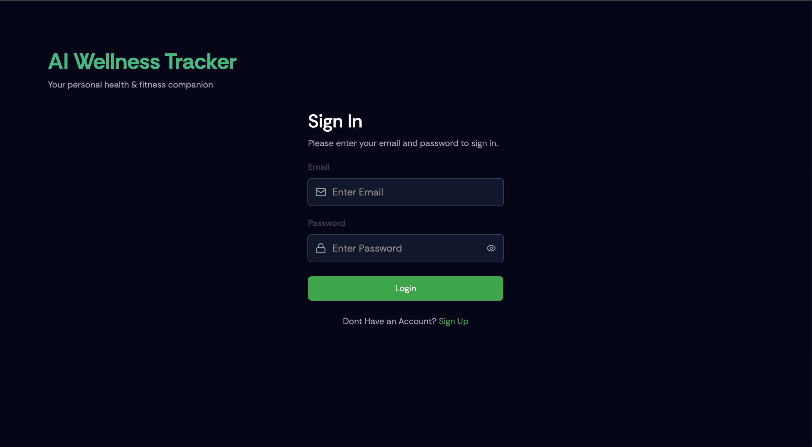

# AI Wellness Tracker 🏋️

A full stack AI-powered fitness tracking app that helps users monitor their daily food intake, track workouts, and analyze meals using Google Gemini AI.

## 🔗 Links
- **Live App:** [ai-wellness-tracker-kohl.vercel.app](https://ai-wellness-tracker-kohl.vercel.app)

## 📸 Screenshot

## ✨ Features
- User authentication (sign up, log in, log out)
- Food log with meal tracking (breakfast, lunch, dinner, snacks)
- AI food image recognition using Google Gemini
- Activity log with calorie tracking
- Dashboard with weekly progress charts
- Light/dark mode toggle
- Personalized user profile
- Daily calorie and activity progress bars

## 🛠 Tech Stack
### Frontend
- React
- TypeScript
- Tailwind CSS
- Recharts
- Lucide React
- React Hot Toast
- Axios

### Backend
- Strapi v5
- SQLite
- Google Gemini AI
- Node.js

### Deployment
- Frontend: Vercel
- Backend: Railway

## 🚀 Getting Started

### Prerequisites
- Node.js v20
- npm

### Installation

**Clone the repo:**
git clone https://github.com/eissamonet/AI-Wellness-Tracker.git
cd AI-Wellness-Tracker

**Install frontend dependencies:**
cd client
npm install

**Install backend dependencies:**
cd ../server
npm install

### Environment Variables

**client/.env:**
VITE_STRAPI_API_URL=http://localhost:1337

**server/.env:**
GEMINI_API_KEY=your_gemini_api_key
APP_KEYS=your_app_keys
API_TOKEN_SALT=your_api_token_salt
ADMIN_JWT_SECRET=your_admin_jwt_secret
JWT_SECRET=your_jwt_secret

### Running Locally

**Start the backend:**
cd server
npm run develop

**Start the frontend:**
cd client
npm run dev

Visit http://localhost:5173 in your browser.
